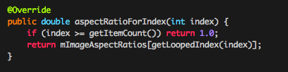

# AspectRecyclerLayoutManager-android
Full Aspect Recycler LayoutManager , Support Certain Row Number

 

## Usage
See the sample project for a complete solution on how to use AspectLayoutManager. Below are the specific steps.

And then, in your RecyclerView adapter, or some other class of your choosing, implement `SizeCalculatorListener`. This implementation got passed to the layout manager above.
 

